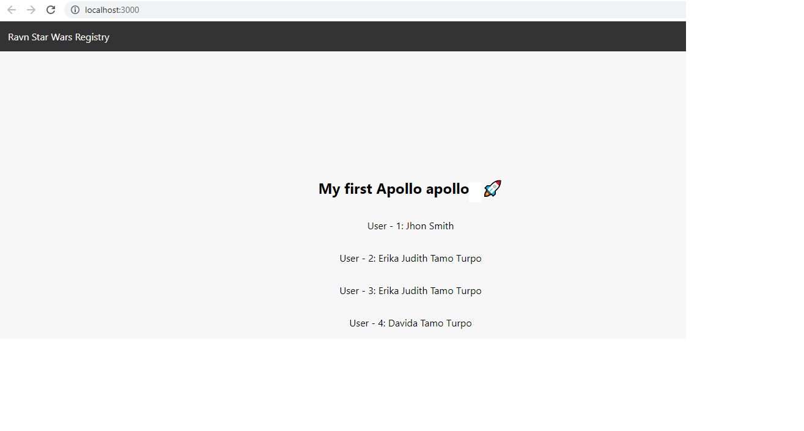

# EjemplodeGraphfSQL
Dijango : http://127.0.0.1:8000/ Modelo de Usuario

React   : npm start

Guia: https://zoejoyuliao.medium.com/django-graphql-react-2-integrate-graphql-into-your-react-project-71fa74f1cb00

